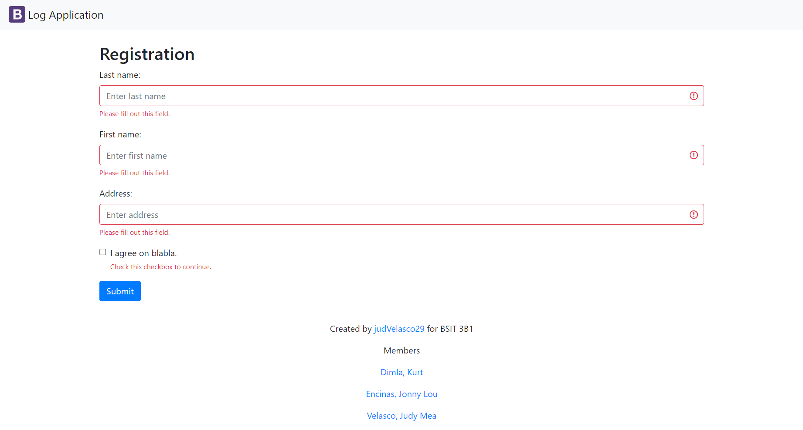
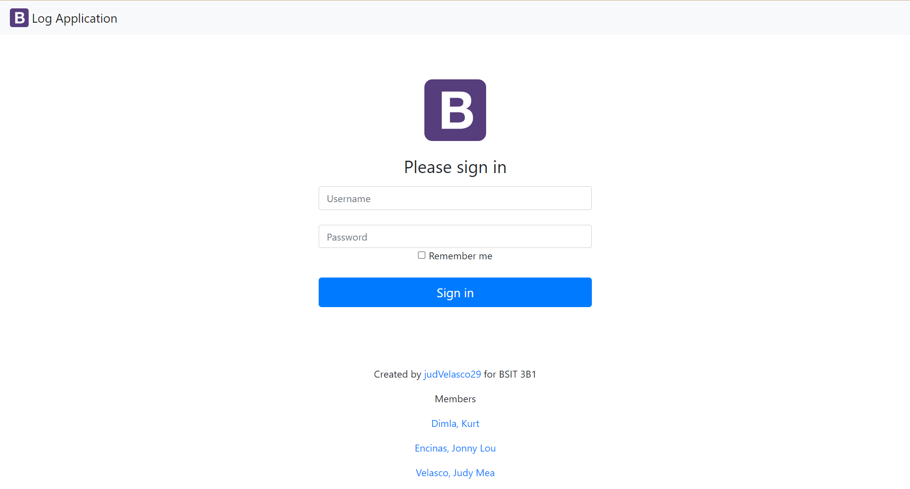
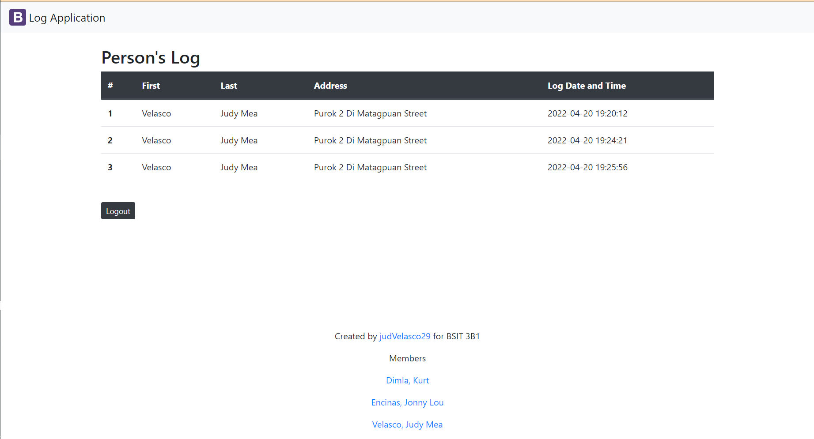

# logApp-scaling-octo
# logApp-scaling-octo

This repo is for Practice Set 5-06

#  :rocket:  For 10 Documentation

###  :triangular_flag_on_post: Name/Description
   # LogApp 
  > This is a web application were the user could log in into their acccount, can view the list of names they entered and could also log out ther account if they want.

###  :triangular_flag_on_post: Visuals

 ##  :memo: Registration Form
 

 ## :computer: Log In  
 

 ## :clipboard: Log In  
 

###  :triangular_flag_on_post: Installation

## :diamond_shape_with_a_dot_inside: 
> * Create a Github account 
> * Create a remote repository in Github and name it.
> * Also creat local repository on your computer, name it the same as your remote repository
> * Open the command prompt (CMD) on your computer and open the local reposiroty by using:
> ~~~
> $ C:/>cd (name of local reposiroty) ex: LogApp
> ~~~
> * Create a folder/file inside you local repository by using: 
> ~~~
> $ C:/LogApp/>md nameOfFolder/File
> ~~~
> * Then start adding other files that include in your project
> * For your database file, copy the folder in **htdocs** which is inside your server **XAMPP or WAMP**
> * Start the server
> * Open phpMyAdmin in your browser, log in, and start creating a database.
> * Then export your database and copy it to your **logApp** file 
> * Start to add, commit and push those files in your remote repository on Github using:
~~~
$ C:/LogApp/>git init
$ C:/LogApp/>git add .
$ C:/LogApp/>git commit -m
$ C:/LogApp/>git remote add origin <link of remote repo>
$ C:/LogApp/>git push -u origin master
~~~
> * If you add/edit any file in your local repo, just repeat the steps in adding and pushing on your repo.

###  :triangular_flag_on_post: :bust_in_silhouette: Authors

## :girl: **Judy Mea L. Velasco**

## :woman: **Jonny Lou L. Encinas**

## :man: **Kurt Dimla**

  